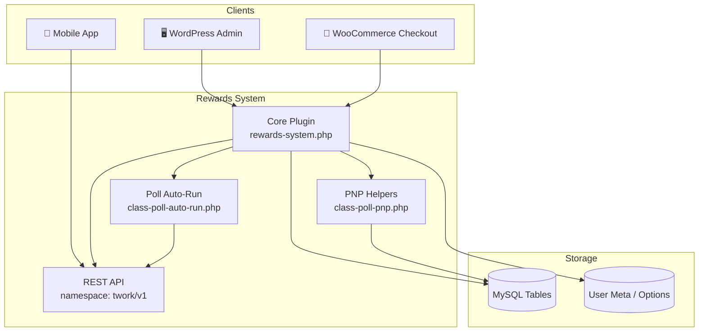

# 🎁 Rewards System

[](https://wordpress.org/)
[](https://woocommerce.com/)
[](https://www.php.net/)
[](LICENSE)
[](https://github.com/tworksystem)
[](#-support)

> 🚀 A production-grade WordPress plugin for loyalty rewards, point ledgers, engagement hubs, and mobile-app REST APIs — built for WooCommerce-powered commerce platforms.

**Rewards System** is the official backend engine behind PLANETmm mobile commerce experiences. It manages order-linked reward transactions, point balances, exchange workflows, interactive engagement (banners, quizzes, polls), lucky box gamification, CMS content delivery, and comprehensive admin tooling — all exposed through a secure `twork/v1` REST namespace for native apps.

🏢 **Maintained by [System](https://github.com/tworksystem)** — enterprise WordPress & mobile commerce solutions.

---

## 📋 Table of Contents

- [✨ Highlights](#-highlights)
- [🏗️ Architecture Overview](#️-architecture-overview)
- [🔗 Plugin Ecosystem](#-plugin-ecosystem)
- [📦 Requirements](#-requirements)
- [⚡ Quick Start](#-quick-start)
- [⚙️ Configuration](#️-configuration)
- [🎯 Core Modules](#-core-modules)
- [🔌 REST API Reference](#-rest-api-reference)
- [🗄️ Database Schema](#️-database-schema)
- [🛡️ Security & Permissions](#️-security--permissions)
- [🧰 WP-CLI Commands](#-wp-cli-commands)
- [📁 Project Structure](#-project-structure)
- [🛠️ Development](#️-development)
- [🚀 Deployment](#-deployment)
- [🔧 Troubleshooting](#-troubleshooting)
- [🤝 Contributing](#-contributing)
- [📜 Changelog](#-changelog)
- [📄 License](#-license)
- [👤 Author & Support](#-author--support)

---

## ✨ Highlights

| Area | What you get |
|------|----------------|
| 💰 **Points & Ledger** | Pending → approved reward transactions, unified point ledger, earn/redeem flows |
| 🛒 **WooCommerce** | Automatic pending rewards on new orders; tier-aware bonus multipliers |
| 🎮 **Engagement Hub** | Banners, quizzes, polls, announcements with scheduling, targeting, and live updates |
| 🗳️ **Poll Betting (PNP)** | Point-based voting, auto-run resolution, session-scoped results, winner payouts |
| 🎰 **Lucky Box** | Per-user toggle, banner config, open/reward REST endpoints |
| 💱 **Exchange Requests** | Mobile-initiated point exchange with admin approval workflow |
| 📱 **Mobile REST API** | Full `wp-json/twork/v1/*` surface for Flutter / native app clients |
| 📊 **Admin Dashboard** | User management, transaction audit, bulk actions, exports, activity scoring |
| 🔔 **FCM Integration** | Token cache invalidation hooks for push notification plugins |
| 📈 **Usage Analytics** | Session tracking with device info and app version telemetry |

---

## 🏗️ Architecture Overview



**Design principles**

- **Single source of truth** — Point balances sync through `twork_point_transactions`; legacy meta is fallback only.
- **Modular poll stack** — Auto-run logic and PNP currency helpers live in dedicated classes under `includes/`.
- **Idempotent migrations** — Table creation and column migrations run safely on activation and `plugins_loaded`.
- **REST-first mobile contract** — All app-facing features expose versioned endpoints with explicit permission callbacks.
- **Audit-ready admin flows** — Transactions and exchange requests track who created, approved, or rejected each action.

---

## 🔗 Plugin Ecosystem

This plugin is part of the **System** plugin suite for mobile commerce:

| Plugin | Role |
|--------|------|
| 🎁 **Rewards System** *(this repo)* | Rewards, engagement hub, polls, lucky box, REST APIs |
| 💎 **Points System** | Enhanced point balance, deductions, and ledger APIs |
| 🔔 **FCM Notify** | Push notifications on reward and engagement events |

Browse all official plugins at **[github.com/tworksystem](https://github.com/tworksystem)**.

---

## 📦 Requirements

| Dependency | Minimum Version |
|------------|-----------------|
| WordPress | 5.0+ |
| PHP | 7.4+ |
| WooCommerce | 5.0+ |
| MySQL / MariaDB | 5.6+ |

**Recommended PHP extensions:** `json`, `mysqli`, `curl`, `mbstring`

---

## ⚡ Quick Start

### 📥 Manual Installation

1. Download or clone this repository into `wp-content/plugins/`.
2. Ensure the folder is named `rewards-system`.
3. Activate **Rewards System** from **Plugins** in wp-admin.
4. Open **Rewards** in the admin sidebar and complete initial settings.

### 🔗 Clone via Git

```bash
cd wp-content/plugins
git clone https://github.com/tworksystem/twork-rewards-system.git rewards-system
```

Then activate the plugin in WordPress.

### ✅ Post-Activation Checklist

- [ ] Confirm database tables were created (see [Database Schema](#️-database-schema))
- [ ] Configure minimum exchange points and reward defaults
- [ ] Set up engagement items (banner / quiz / poll) if using the mobile feed
- [ ] Test a REST call: `GET /wp-json/twork/v1/rewards/exchange-settings`
- [ ] Place a test WooCommerce order and verify a pending reward transaction appears
- [ ] Flush permalinks: **Settings → Permalinks → Save Changes**

---

## ⚙️ Configuration

Navigate to **Rewards** in wp-admin. Key setting groups:

| Section | Purpose |
|---------|---------|
| ⚙️ **General Settings** | Default points, lucky box toggle, vote system, exchange minimums |
| 🏆 **Point Tiers** | Membership tiers with thresholds, multipliers, colors, and icons |
| 👥 **User Page** | Columns, filters, activity scoring weights, caching, bulk actions |
| 🎯 **Engagement Hub** | Banners, quizzes, polls, announcements, rotation and scheduling |
| 💱 **Exchange Requests** | Review, approve, or reject mobile exchange submissions |
| 📱 **App Update** | Force-update rules and version messaging for mobile clients |
| 📄 **CMS Content** | FAQ, About Us, and static page content served via REST |

---

## 🎯 Core Modules

### 💰 Rewards & Transactions

- Creates **pending** reward transactions when WooCommerce orders are placed.
- Admins approve, adjust, or cancel transactions with full audit fields (`created_by`, `approved_by`, soft delete).
- Point ledger sync writes to `twork_point_transactions` for consistent balance reads in the app.

### 🎯 Engagement Hub

Supports item types: `banner`, `quiz`, `poll`, `announcement`.

- **Feed API** delivers personalized, scheduled content to mobile clients.
- **Interact API** records quiz answers, poll votes, banner clicks, and view events.
- **Live updates** endpoint returns lightweight count/total deltas without full feed refresh.
- **Poll auto-run** resolves timed polls via cron and lazy REST evaluation (`TWork_Poll_Auto_Run`).

### 🗳️ Poll Betting (PNP)

The `TWork_Poll_PNP` helper bridges poll economics with the point ledger:

- Reads balance from **Points System** when available.
- Awards winners through `award_engagement_points_to_user()`.
- Deducts vote stakes via `deduct_for_poll_vote()` when integrated.
- Falls back to legacy `_user_pnp_balance` meta when no points plugin is active.

### 🎰 Lucky Box

- Per-user enable/disable via user meta and global setting.
- REST: config lookup, open action, and banner retrieval.
- Admin can upload lucky box banner imagery.

### 💱 Exchange Workflow

- Mobile users submit exchange requests through REST.
- Admins process pending requests with approve/reject tracking and bulk actions.

### 📊 Activity & Usage

- Login and REST activity tracking with configurable inactivity thresholds.
- App session start/end with device info and version for analytics exports.

---

## 🔌 REST API Reference

**Base URL:** `{site}/wp-json/twork/v1`

**Authentication:** WordPress cookie auth, Application Passwords, or your configured OAuth layer. Most endpoints require the authenticated user to match the requested `user_id` or hold `manage_options`.

### 🎰 Lucky Box

| Method | Endpoint | Description |
|--------|----------|-------------|
| `GET` | `/luckybox/config/{user_id}` | Lucky box config for a user |
| `POST` | `/luckybox/open` | Open lucky box (`user_id` in body) |
| `GET` | `/luckybox/banner` | Global lucky box banner (public) |

### 💰 Points

| Method | Endpoint | Description |
|--------|----------|-------------|
| `GET` | `/points/balance/{user_id}` | Current point balance |
| `GET` | `/points/transactions/{user_id}` | Paginated transaction history |
| `POST` | `/points/earn` | Earn points (controlled contexts) |
| `POST` | `/points/redeem` | Redeem points |

### 💱 Rewards & App

| Method | Endpoint | Description |
|--------|----------|-------------|
| `POST` | `/rewards/exchange-request` | Submit exchange request |
| `GET` | `/rewards/exchange-settings` | Minimum exchange rules |
| `GET` | `/app/update-settings` | Mobile force-update configuration |

### 🎯 Engagement

| Method | Endpoint | Description |
|--------|----------|-------------|
| `GET` | `/engagement/feed/{user_id}` | Personalized engagement feed |
| `POST` | `/engagement/interact` | Record interaction (vote, answer, view) |
| `GET` | `/engagement/updates/{user_id}` | Lightweight poll/count updates |
| `GET` | `/engagement/result/{item_id}` | Resolved engagement result |

### 🗳️ Poll (Auto-Run Module)

| Method | Endpoint | Description |
|--------|----------|-------------|
| `GET` | `/poll/state/{poll_id}` | Lazy-evaluated poll state (AUTO_RUN) |
| `GET` | `/poll/results/{poll_id}/{session_id}` | Session-scoped poll results |

### 📈 Usage & Activity

| Method | Endpoint | Description |
|--------|----------|-------------|
| `POST` | `/usage/start` | Begin app usage session |
| `POST` | `/usage/end` | End app usage session |
| `GET` | `/usage/stats/{user_id}` | Usage statistics |
| `GET` | `/user/activity/{user_id}` | Activity status badge data |

### 📄 CMS Content

| Method | Endpoint | Description |
|--------|----------|-------------|
| `GET` | `/page-content/{page_slug}` | Static page by slug |
| `GET` | `/page-content` | All page content entries |
| `GET` | `/faq` | FAQ items |
| `GET` | `/about-us` | About Us content |

### 📦 Standard Response Shape

```json
{
  "success": true,
  "data": {}
}
```

**Error example:**

```json
{
  "success": false,
  "message": "Human-readable error description"
}
```

### 🔑 Example Request (cURL)

```bash
curl -X GET "https://your-site.com/wp-json/twork/v1/rewards/exchange-settings" \
  -H "Authorization: Basic YOUR_APP_PASSWORD"
```

---

## 🗄️ Database Schema

Tables created on activation (prefix `{wp_prefix}`):

| Table | Purpose |
|-------|---------|
| `twork_rewards_transactions` | Order-linked reward transactions (pending/approved/cancelled) |
| `twork_exchange_requests` | Mobile exchange submissions and admin workflow |
| `twork_engagement_items` | Banners, quizzes, polls, announcements |
| `twork_user_interactions` | User votes, answers, views with interaction metadata |
| `twork_poll_session_rewards` | Session-scoped poll reward distribution flags |
| `twork_point_transactions` | Authoritative point ledger (earn/spend/adjust) |
| `twork_page_content` | CMS pages exposed to mobile |
| `twork_faq` | FAQ questions and answers |
| `twork_about_us_content` | About Us structured content |
| `twork_usage_tracking` | App session telemetry |

Migrations run idempotently — safe to re-run on plugin update.

---

## 🛡️ Security & Permissions

- ✅ Nonce verification on all admin POST handlers
- ✅ Capability checks (`manage_options`) for admin screens
- ✅ REST permission callbacks distinguish authenticated users vs public read-only routes
- ✅ Input sanitization via `sanitize_text_field`, `absint`, and prepared SQL statements
- ✅ Soft-delete support on transactions with restore and permanent purge flows
- 🔒 Sensitive admin-only data is **not** exposed through public REST fields

---

## 🧰 WP-CLI Commands

When [WP-CLI](https://wp-cli.org/) is available:

```bash
wp twork-rewards fix-legacy-labels
```

Repairs legacy transaction labels for consistency after schema or naming migrations.

---

## 📁 Project Structure

```
rewards-system/
├── rewards-system.php      # 🧠 Main plugin bootstrap, admin UI, REST, DB
├── includes/
│   ├── class-poll-auto-run.php   # 🗳️ Poll lazy eval + session results REST
│   └── class-poll-pnp.php        # 💎 PNP / point balance helpers for polls
├── assets/
│   └── js/
│       └── poll-options-media.js # 🖼️ Admin poll option repeater + media library
├── README.md                     # 📖 Project documentation
├── LICENSE                       # 📄 MIT License
├── .gitignore                    # 🚫 Ignore rules
└── .gitattributes                # 🔧 Line-ending normalization
```

---

## 🛠️ Development

### Local Setup

1. Use a staging WordPress + WooCommerce stack — never test migrations on production first.
2. Enable `WP_DEBUG` and `WP_DEBUG_LOG` to surface REST registration logs.
3. Flush rewrite rules after route changes: **Settings → Permalinks → Save**.

### Coding Standards

- Follow [WordPress Coding Standards](https://developer.wordpress.org/coding-standards/wordpress-coding-standards/)
- Escape output, sanitize input, verify nonces
- Prefer `$wpdb->prepare()` for all dynamic SQL
- Keep mobile REST contracts backward-compatible — version breaking changes require app coordination

### Pre-Release Checklist

- [ ] Activation creates all tables on a clean install
- [ ] WooCommerce order creates pending reward transaction
- [ ] Engagement feed + interact flow works for quiz and poll
- [ ] Poll auto-run cron resolves expired polls
- [ ] Exchange request approve/reject updates ledger correctly
- [ ] REST permission boundaries verified for non-admin users

---

## 🚀 Deployment

### 📦 Staging → Production

1. 🧪 Run the [Pre-Release Checklist](#pre-release-checklist) on staging.
2. 💾 Back up the WordPress database and `wp-content/plugins/rewards-system/`.
3. 📤 Deploy plugin files via Git pull, SFTP, or CI pipeline.
4. 🔄 Visit **Plugins** to confirm the version; re-save permalinks.
5. 👀 Monitor `wp-content/debug.log` for REST registration errors.

### ⚡ Performance Tips

- Enable user-page caching in plugin settings for large user bases.
- Use object caching (Redis/Memcached) at the WordPress layer when available.
- Schedule poll auto-run cron during low-traffic windows.

---

## 🔧 Troubleshooting

| Symptom | Likely cause | Fix |
|---------|--------------|-----|
| 🔴 REST returns 404 | Permalinks not flushed | **Settings → Permalinks → Save** |
| 🔴 Balance mismatch | Ledger table missing | Deactivate & reactivate plugin to run migrations |
| 🔴 Poll not resolving | Cron not firing | Verify `wp-cron.php` or system cron is active |
| 🔴 Engagement feed empty | Items outside date range | Check item `start_date` / `end_date` and status |
| 🔴 Exchange blocked | Below minimum points | Review **Exchange Settings** in admin |

Enable debug logging:

```php
define('WP_DEBUG', true);
define('WP_DEBUG_LOG', true);
define('WP_DEBUG_DISPLAY', false);
```

---

## 🤝 Contributing

Contributions are welcome! 🙌

1. 🍴 Fork the repository
2. 🌿 Create a feature branch: `git checkout -b feat/your-feature-name`
3. ✍️ Commit using [Conventional Commits](#-commit-message-convention) with the date prefix
4. 📤 Push and open a Pull Request

### 📝 Commit Message Convention

All commits use a **type**, **date** (`DDMMYYYY`), and **description**:

```
feat: 24052026 - add poll session reward reconciliation
fix: 24052026 - restore balance UI when headline total is unchanged
docs: 24052026 - expand REST API reference for engagement endpoints
refactor: 24052026 - extract poll PNP helpers into dedicated class
chore: 24052026 - normalize line endings with gitattributes
perf: 24052026 - cache live poll option totals on engagement items
test: 24052026 - add integration tests for exchange approval flow
```

| Type | When to use |
|------|-------------|
| `feat` | New feature or capability |
| `fix` | Bug fix |
| `docs` | Documentation only |
| `refactor` | Code change without behavior change |
| `chore` | Tooling, config, housekeeping |
| `perf` | Performance improvement |
| `test` | Tests only |

---

## 📜 Changelog

### 🆕 v1.0.0 — May 2026

- 🎉 Initial public release on GitHub (`tworksystem/twork-rewards-system`)
- 💰 Full rewards transaction lifecycle with WooCommerce order hooks
- 🎯 Engagement Hub: banners, quizzes, polls, announcements
- 🗳️ Poll auto-run module with session-scoped results REST
- 💎 PNP virtual currency integration with Points System
- 📱 Comprehensive `twork/v1` REST API for mobile clients
- 🎰 Lucky box, exchange requests, usage tracking, and CMS content APIs
- 📊 Admin dashboard with bulk actions, exports, and activity scoring

---

## 📄 License

This project is licensed under the **MIT License** — see the [LICENSE](LICENSE) file for details.

---

## 👤 Author & Support

**Maw Kunn Myat** · Lead Developer  
**System**

| Channel | Link |
|---------|------|
| 📧 Primary Email | [mapoeeiphyu2017.miitinternship@gmail.com](mailto:mapoeeiphyu2017.miitinternship@gmail.com) |
| 📧 Support | [support@tworksystem.com](mailto:support@tworksystem.com) |
| 🏢 Organization | [@tworksystem](https://github.com/tworksystem) |
| 👤 Developer | [@mawkunnmyat](https://github.com/mawkunnmyat) |
| 📦 Repository | [github.com/tworksystem/twork-rewards-system](https://github.com/tworksystem/twork-rewards-system) |
| 🐛 Issues | [Report a bug](https://github.com/tworksystem/twork-rewards-system/issues) |
| 🏷️ Releases | [View releases](https://github.com/tworksystem/twork-rewards-system/releases) |

---

<div align="center">

**Version:** 1.0.0 · **Last Updated:** May 24, 2026 · **Maintained by:** System

Made with ❤️ by [System](https://github.com/tworksystem)

</div>
