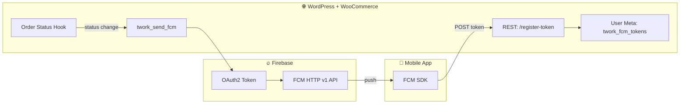

# 📱 T-Work FCM Notify

[](https://wordpress.org/)
[](https://woocommerce.com/)
[](https://www.php.net/)
[](https://firebase.google.com/docs/cloud-messaging)
[](LICENSE)

> 🔔 A production-ready WordPress plugin that connects **Firebase Cloud Messaging (FCM)** with **WooCommerce** to deliver real-time push notifications when order statuses change — built for mobile commerce apps (Flutter, React Native, native Android/iOS).

---

## 📖 Table of Contents

- [Overview](#-overview)
- [Features](#-features)
- [Architecture](#-architecture)
- [Requirements](#-requirements)
- [Installation](#-installation)
- [Configuration](#-configuration)
- [REST API Reference](#-rest-api-reference)
- [Notification Behavior](#-notification-behavior)
- [Mobile App Integration](#-mobile-app-integration)
- [Security](#-security)
- [Debugging & Troubleshooting](#-debugging--troubleshooting)
- [Development](#-development)
- [Contributing](#-contributing)
- [Changelog](#-changelog)
- [License](#-license)
- [Support](#-support)

---

## 🌟 Overview

**T-Work FCM Notify** bridges your WordPress/WooCommerce backend and mobile clients through Firebase Cloud Messaging. It provides:

- 🔐 Secure device token registration via WordPress REST API
- 📦 Automatic push notifications on WooCommerce order status transitions
- 🤖 Cross-platform delivery (Android & iOS) using FCM HTTP v1
- 🧩 Stable `data` payload keys for mobile app routing and deep linking

Ideal for **T-Work Commerce**, **MingalarBuy**, and similar WooCommerce-powered mobile storefronts.

---

## ✨ Features

| Feature | Description |
|--------|-------------|
| 🔌 **REST API** | Register, update, and manage FCM device tokens per WordPress user |
| 🛒 **WooCommerce Hooks** | Sends notifications automatically on `woocommerce_order_status_changed` |
| 📲 **Multi-Device Support** | Up to 10 tokens per user with platform-aware deduplication |
| 🚀 **FCM HTTP v1** | Modern Firebase API with OAuth2 service-account authentication |
| 🔑 **CamelCase Payloads** | Preserves mobile-friendly keys (`userId`, `orderId`, `currentBalance`) |
| 🛡️ **Security Hardening** | Input sanitization, token validation, masked debug output |
| 🔇 **Silent Suppression** | Optional per-request FCM skip for admin bulk saves |
| 🐛 **Debug Endpoints** | Inspect registered tokens during development (masked) |

---

## 🏗 Architecture



### 📂 Plugin Structure

```
twork-fcm-notify/
├── twork-fcm-notify.php      # Main plugin bootstrap & logic
├── serviceAccountKey.json.example
├── .gitignore
├── LICENSE
└── README.md
```

> ⚠️ `serviceAccountKey.json` is **never** committed. Copy from the example file locally.

---

## 📋 Requirements

| Dependency | Minimum Version |
|-----------|-----------------|
| WordPress | 5.0+ |
| WooCommerce | 3.0+ |
| PHP | 7.4+ (OpenSSL extension required) |
| Firebase Project | FCM enabled + Service Account JSON |

---

## 📦 Installation

### 1️⃣ Clone the Repository

```bash
cd wp-content/plugins
git clone https://github.com/tworksystem/twork-fcm-notify.git
cd twork-fcm-notify
```

### 2️⃣ Configure Firebase Credentials

1. Open [Firebase Console](https://console.firebase.google.com/) 🔥
2. Select your project (or create one)
3. Go to **Project Settings → Service accounts**
4. Click **Generate new private key**
5. Save the downloaded JSON as `serviceAccountKey.json` in this plugin folder

```bash
cp serviceAccountKey.json.example serviceAccountKey.json
# Edit serviceAccountKey.json with your real Firebase credentials
chmod 600 serviceAccountKey.json
```

### 3️⃣ Set Firebase Project ID

Edit `twork-fcm-notify.php`:

```php
define('TWORK_FCM_PROJECT_ID', 'your-firebase-project-id');
```

### 4️⃣ Activate in WordPress

1. Go to **WordPress Admin → Plugins**
2. Find **T-Work FCM Notify**
3. Click **Activate** ✅

---

## ⚙️ Configuration

| Constant | Description | Default |
|----------|-------------|---------|
| `TWORK_FCM_PROJECT_ID` | Firebase project ID | Must be set manually |
| `TWORK_FCM_SERVICE_ACCOUNT_JSON` | Path to service account JSON | `__DIR__ . '/serviceAccountKey.json'` |

### 🔇 Suppress FCM for a Single Request

When saving admin forms (e.g. Engagement Hub bulk updates), POST:

```
twork_skip_fcm_notify=1
```

This prevents notification storms during backend edits.

---

## 📡 REST API Reference

Base URL: `https://your-site.com/wp-json/twork/v1`

### 🔐 Register / Update FCM Token

**`POST /register-token`**

Registers or refreshes a device token for a WordPress user.

**Request Body**

```json
{
  "userId": "123",
  "fcmToken": "dP0X4xGxR5y3z8vW2mN6kL9hJ...",
  "platform": "android"
}
```

| Field | Type | Required | Notes |
|-------|------|----------|-------|
| `userId` | string/int | ✅ | Valid WordPress user ID |
| `fcmToken` | string | ✅ | FCM registration token (min 10 chars) |
| `platform` | string | ❌ | `android` or `ios` (default: `android`) |

**Success — `200 OK`**

```json
{
  "success": true,
  "tokenCount": 2,
  "platform": "android"
}
```

**Error — `400 Bad Request`**

```json
{
  "success": false,
  "error": "userId and fcmToken required"
}
```

**cURL Example**

```bash
curl -X POST "https://your-site.com/wp-json/twork/v1/register-token" \
  -H "Content-Type: application/json" \
  -d '{"userId":"123","fcmToken":"YOUR_FCM_TOKEN","platform":"ios"}'
```

---

### 🐛 Debug: List User Tokens

**`GET /debug/tokens/{user_id}`**

Returns masked tokens for development. **Restrict or disable in production.**

**Success — `200 OK`**

```json
{
  "userId": 123,
  "tokenCount": 1,
  "tokens": [
    {
      "token": "dP0X4xGxR5y3z8vW2mN6kL9hJ...",
      "platform": "android",
      "updated_at": 1716508800
    }
  ]
}
```

---

## 🔔 Notification Behavior

Triggered on WooCommerce order status changes for logged-in customers with registered tokens.

| Status | Notification Title Pattern |
|--------|---------------------------|
| `pending` | Order #123 is being processed |
| `processing` | Order #123 is being prepared |
| `on-hold` | Order #123 is on hold |
| `completed` | Order #123 has been completed |
| `cancelled` | Order #123 has been cancelled |
| `refunded` | Order #123 has been refunded |
| `failed` | Order #123 payment failed |
| `shipped` | Order #123 has been shipped |

### 📦 Data Payload

Every notification includes a `data` map (all values are strings per FCM spec):

```json
{
  "orderId": "123",
  "status": "completed",
  "total": "99.99",
  "currency": "USD",
  "type": "order_status_update",
  "userId": "456",
  "user_id": "456"
}
```

Mobile apps should route on `type` and `status` for deep linking (e.g. open Order Details screen).

---

## 📱 Mobile App Integration

### Recommended Flow

1. 📲 Obtain FCM token in the mobile app after login
2. 🔗 `POST /register-token` with WordPress user ID
3. 🔔 Handle foreground/background notification callbacks
4. 🧭 Parse `data.type` and navigate accordingly

### Flutter Example (pseudo-code)

```dart
final token = await FirebaseMessaging.instance.getToken();
await http.post(
  Uri.parse('$baseUrl/wp-json/twork/v1/register-token'),
  headers: {'Content-Type': 'application/json'},
  body: jsonEncode({
    'userId': userId.toString(),
    'fcmToken': token,
    'platform': Platform.isIOS ? 'ios' : 'android',
  }),
);
```

> 💡 Re-register the token on app launch and whenever Firebase refreshes it.

---

## 🛡 Security

### ✅ Built-In Protections

- WordPress sanitization on all REST inputs
- User existence validation before token storage
- Platform whitelist (`android` / `ios`)
- Token deduplication and 10-token cap per user
- Service account file permission warnings in logs
- Masked tokens in debug responses

### ⚠️ Critical Practices

| Rule | Why |
|------|-----|
| 🚫 Never commit `serviceAccountKey.json` | Contains private Firebase credentials |
| 🔒 `chmod 600 serviceAccountKey.json` | Prevents world-readable secrets |
| 🔄 Rotate keys if ever exposed | Invalidate compromised service accounts |
| 🛑 Disable debug routes in production | Prevents token enumeration |
| 🔐 Add auth to REST routes in production | Current routes use open callbacks — wrap with JWT/app auth |

### Credential Rotation

If a key was leaked:

1. Firebase Console → **Service Accounts** → delete old key
2. Generate a new private key
3. Replace `serviceAccountKey.json`
4. Test push delivery end-to-end

---

## 🐛 Debugging & Troubleshooting

### Enable WordPress Debug Logging

Add to `wp-config.php`:

```php
define('WP_DEBUG', true);
define('WP_DEBUG_LOG', true);
define('WP_DEBUG_DISPLAY', false);
```

Logs: `wp-content/debug.log` — search for `[T-Work FCM]`.

### Common Issues

| Symptom | Likely Cause | Fix |
|---------|--------------|-----|
| 📵 No push received | Missing/invalid service account | Verify JSON path & project ID |
| 🔴 HTTP 401 from FCM | Bad private key or clock skew | Regenerate key; check server time |
| 💾 Tokens not saved | Invalid `userId` | Confirm user exists in WP |
| 📱 App ignores data | Key casing broken | This plugin preserves camelCase keys |
| 🔕 Admin save floods devices | Bulk meta updates | Use `twork_skip_fcm_notify=1` |

---

## 🧑‍💻 Development

### Key Functions

| Function | Purpose |
|----------|---------|
| `twork_register_fcm_token()` | REST handler for token registration |
| `twork_send_fcm()` | Sends FCM v1 message to a device token |
| `twork_get_access_token_from_sa()` | OAuth2 JWT exchange with Google |
| `twork_status_message()` | Maps WooCommerce status to user-facing text |

### WordPress Hooks

- `rest_api_init` — registers REST routes
- `woocommerce_order_status_changed` — triggers order notifications

---

## 🤝 Contributing

Contributions are welcome! 🎉 See [CONTRIBUTING.md](CONTRIBUTING.md) for setup, code standards, and PR guidelines.

1. 🍴 Fork the repository
2. 🌿 Create a feature branch: `git checkout -b feat/your-feature`
3. ✅ Commit with the convention below
4. 📤 Push and open a Pull Request

### 📝 Commit Message Convention

```
<type>: 24052026 - <professional description in imperative mood>
```

| Type | When to Use |
|------|-------------|
| `feat` | ✨ New feature or enhancement |
| `fix` | 🐛 Bug fix |
| `docs` | 📚 Documentation only |
| `style` | 💄 Formatting, no logic change |
| `refactor` | ♻️ Code restructure, same behavior |
| `perf` | ⚡ Performance improvement |
| `test` | ✅ Tests added or updated |
| `chore` | 🔧 Tooling, deps, maintenance |
| `ci` | 👷 CI/CD changes |

**Examples**

```
feat: 24052026 - add FCM token registration REST endpoint
fix: 24052026 - preserve camelCase keys in FCM data payload
docs: 24052026 - expand mobile integration guide in README
```

---

## 📜 Changelog

### 🗓 24 May 2026

- ✨ Published repository under [tworksystem/twork-fcm-notify](https://github.com/tworksystem/twork-fcm-notify)
- 📚 Comprehensive README with architecture, API, and security guides
- 🐛 FCM data payload preserves camelCase keys for Flutter/mobile clients
- 🔇 Added silent FCM suppression flag for admin bulk operations

### 🗓 Earlier Releases

- 🛒 WooCommerce order status push notifications
- 🔐 Service-account based FCM HTTP v1 authentication
- 📲 Multi-platform token storage with deduplication

---

## 📄 License

MIT License — see [LICENSE](LICENSE).

Copyright (c) 2025–2026 [T-Work System](https://github.com/tworksystem) & contributors.

---

## 💬 Support

- 🐛 [Open an Issue](https://github.com/tworksystem/twork-fcm-notify/issues)
- 📖 [Firebase Cloud Messaging Docs](https://firebase.google.com/docs/cloud-messaging)
- 🛒 [WooCommerce Developer Docs](https://developer.woocommerce.com/)
- 🔌 [WordPress Plugin Handbook](https://developer.wordpress.org/plugins/)

---

<p align="center">
  <strong>Version:</strong> 1.0.0 &nbsp;·&nbsp;
  <strong>Last Updated:</strong> 24 May 2026 &nbsp;·&nbsp;
  Made with ❤️ for mobile commerce
</p>
